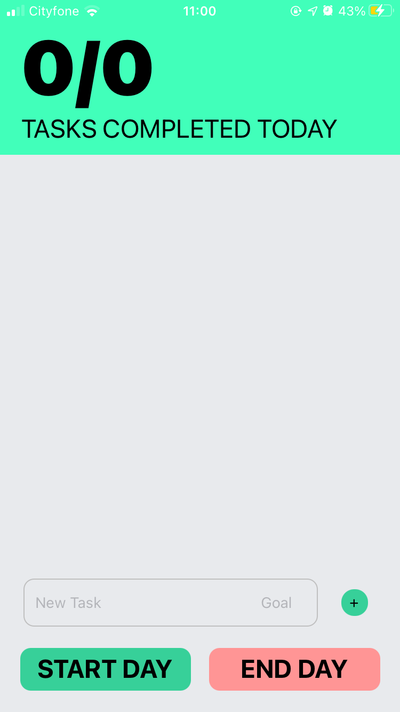
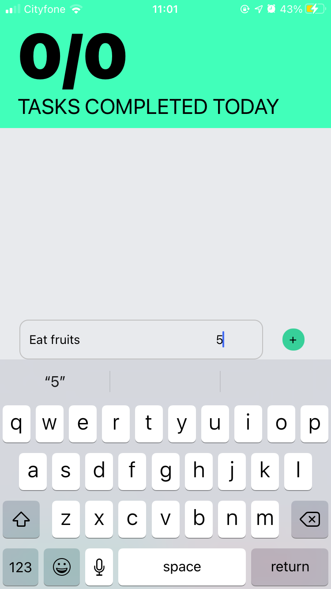
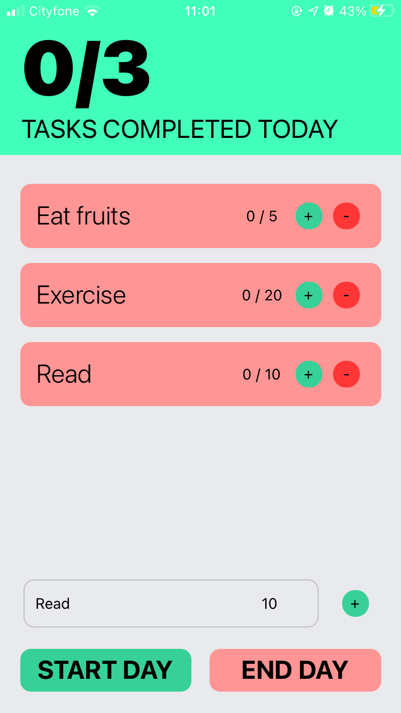
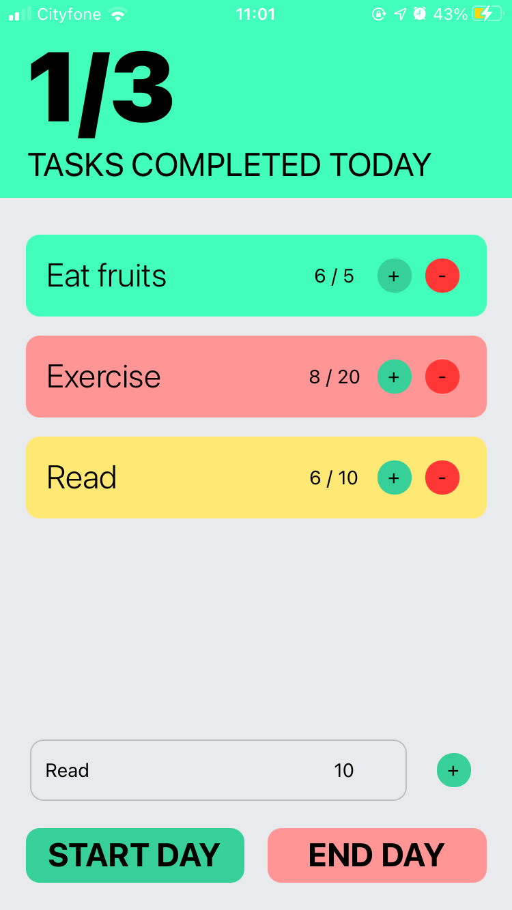
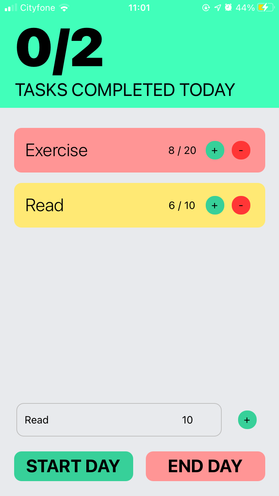
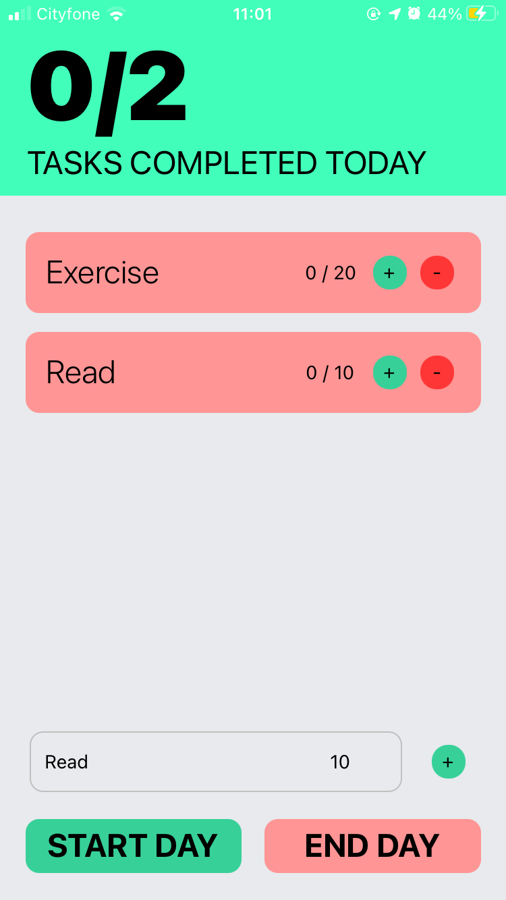

# Introducing Totality!

Totality is an easy-to-use goal/habit tracker for iOS and Android developed using React Native, Expo and Formik.

At the moment there is only a daily tracker that has to be reset manually, but weekly, monthly and annual trackers are on the way along with history! There may even be integrations with the iOS Health API so stay tuned👀

### Installation Guide

To use on your local machine first install <a href=https://nodejs.org/en/>Node.js</>

Then run 

`npm install`

to install the dependencies. After this is complete, run with 

`npm start`

The Expo development environment will open up in your browser. Choose 'Run in web browser' to run locally. You can also use a simulator or install Expo Go on your mobile device and scane the QR code provided to run it on your phone.

### Here's the default view

### You can add tasks

### Update them using the + and - buttons

### Remove them by holding down for 2 seconds

### And reset your progress by pressing "End day"

